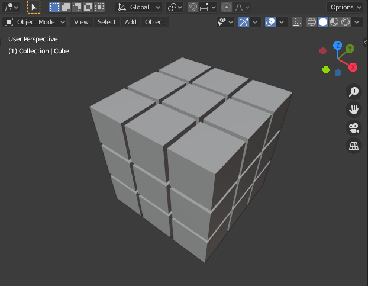

# Blender Know How

The tutorials are available [here](https://www.youtube.com/channel/UCeOLSinEqt5mfzjbuMSZV3g).

---

 

## 👨‍💻 Procedurally Generated Objects

|  | 
|:--:|
| *Code [applyingFunction.py](applyingFunctions.py)* |

 

|  | 
|:--:|
| *Code [rubiksCube.py](rubiksCube.py) and [rubiksCubeForLoop.py](rubiksCubeForLoop.py)* |
