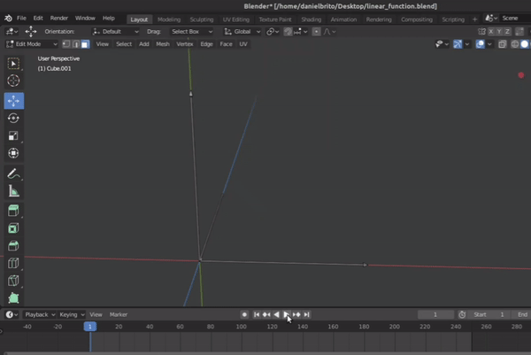
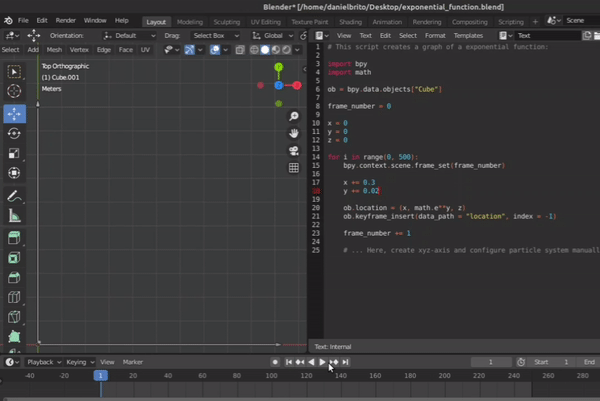
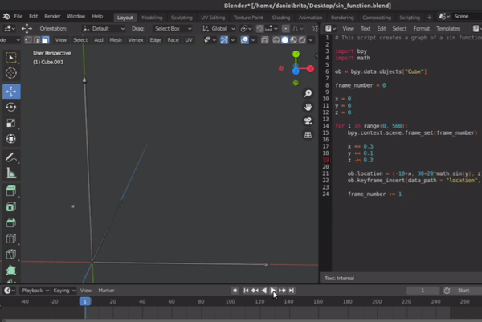
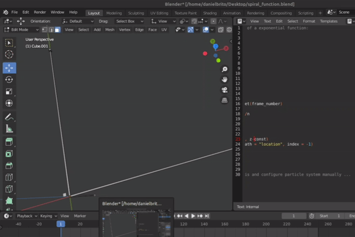

# Math Functions in Blender

## Linear ([Code](linear_function.py))

 

## Exponential ([Code](exponential_function.py))

 

## Sin ([Code](sin_function.py))

 

## Spiral ([Code](spiral_function.py))

